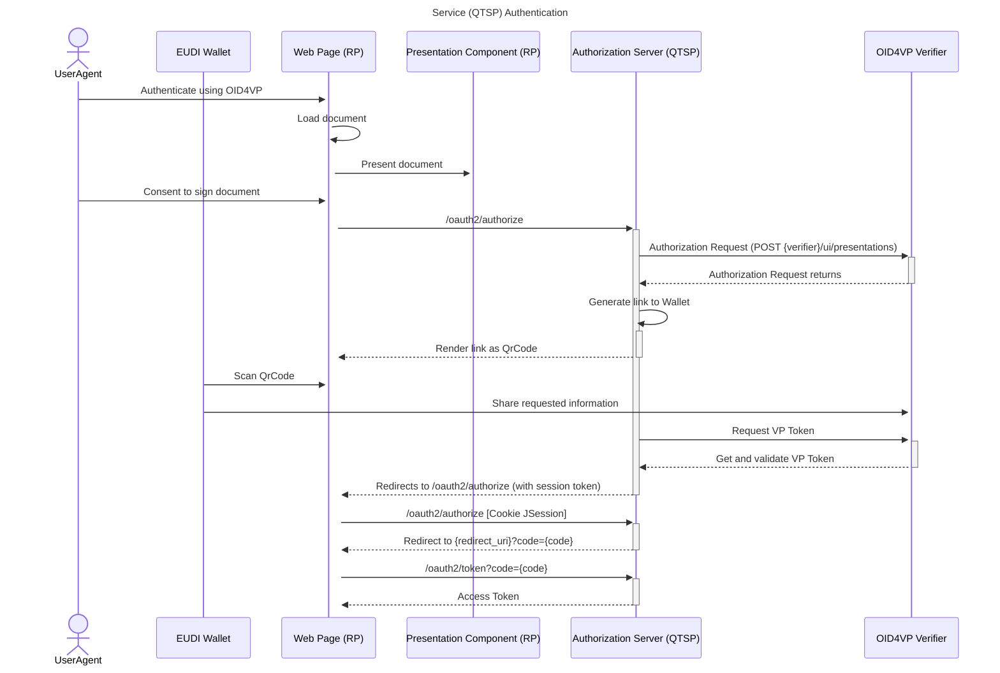
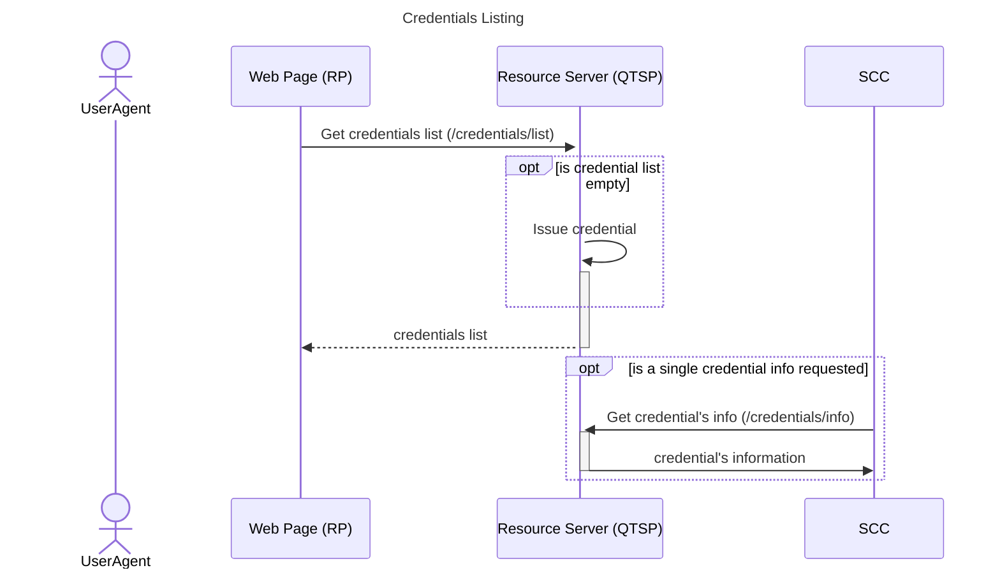
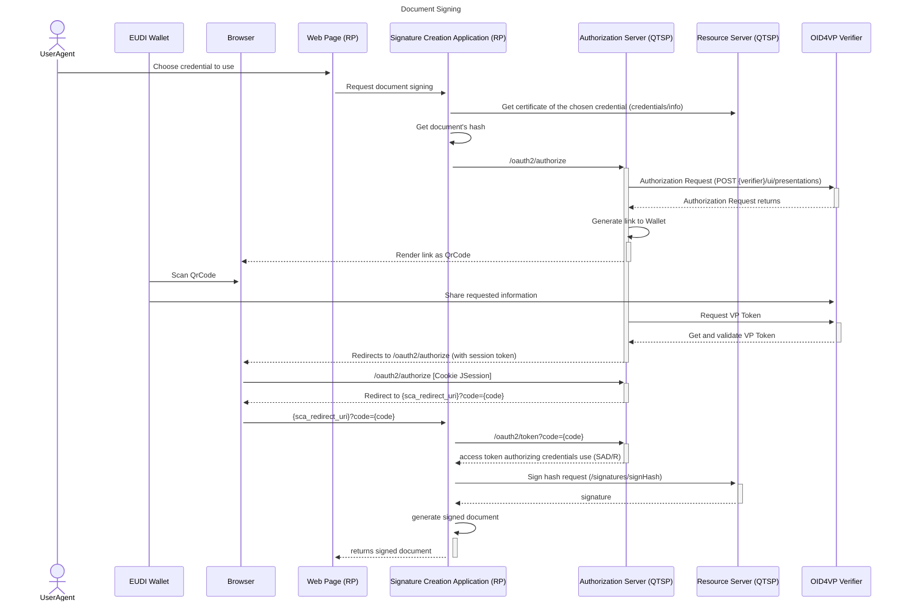

# EUDI RP-Centric Relying Party

:heavy_exclamation_mark: **Important!** Before you proceed, please read
the [EUDI Wallet Reference Implementation project description](https://github.com/eu-digital-identity-wallet/.github/blob/main/profile/reference-implementation.md)

## Table of Contents

- [EUDI RP-Centric Relying Party](#eudi-rp-centric-relying-party)
  - [Table of contents](#table-of-contents)
  - [Overview](#overview)
  - [Disclaimer](#disclaimer)
  - [Sequence Diagrams](#sequence-diagrams)
    - [Service Authentication](#service-authentication)
    - [Credentials Listing](#credentials-listing)
    - [Credential Authorization](#credential-authorization)
  - [Deployment](#deployment)
  - [How to Contribute](#how-to-contribute)
  - [License](#license)
    - [Third-party component licenses](#third-party-component-licenses)
    - [License details](#license-details)

## Overview

This repository contains the implementation of Relying Party (RP) Web Service for the RP-centric release of the remote Qualified Electronic Signature (rQES) component.

This service relies on a QTSP Service, defined in [this GitHub repository](https://github.com/eu-digital-identity-wallet/eudi-srv-web-walletdriven-rpcentric-signer-qtsp-java) and a SCA component, internal to the RP environment, defined in [this GitHub repository](https://github.com/eu-digital-identity-wallet/eudi-srv-web-rpcentric-signer-sca-java).

Currently, the service is running at [https://rpcentric.signer.eudiw.dev](https://rpcentric.signer.eudiw.dev), but you can [deploy](#deployment) it in your environment.

## Disclaimer

The released software is an initial development release version:

- The initial development release is an early endeavor reflecting the efforts of a short timeboxed
  period, and by no means can be considered as the final product.
- The initial development release may be changed substantially over time, might introduce new
  features but also may change or remove existing ones, potentially breaking compatibility with your
  existing code.
- The initial development release is limited in functional scope.
- The initial development release may contain errors or design flaws and other problems that could
  cause system or other failures and data loss.
- The initial development release has reduced security, privacy, availability, and reliability
  standards relative to future releases. This could make the software slower, less reliable, or more
  vulnerable to attacks than mature software.
- The initial development release is not yet comprehensively documented.
- Users of the software must perform sufficient engineering and additional testing in order to
  properly evaluate their application and determine whether any of the open-sourced components is
  suitable for use in that application.
- We strongly recommend not putting this version of the software into production use.
- Only the latest version of the software will be supported

## Sequence Diagrams

### Service Authentication

### Credentials Listing

### Credential Authorization

## Deployment

### Pre-requisites:

- Python v3.10 or higher
- Flask v2.3 or higher

Click [here](install.md) for detailed installation instructions.

## How to contribute

We welcome contributions to this project. To ensure that the process is smooth for everyone
involved, follow the guidelines found in [CONTRIBUTING.md](CONTRIBUTING.md).

## License

### Third-party component licenses

See [licenses.md](licenses.md) for details.

### License details

Copyright (c) 2024 European Commission

Licensed under the Apache License, Version 2.0 (the "License");
you may not use this file except in compliance with the License.
You may obtain a copy of the License at

    http://www.apache.org/licenses/LICENSE-2.0

Unless required by applicable law or agreed to in writing, software
distributed under the License is distributed on an "AS IS" BASIS,
WITHOUT WARRANTIES OR CONDITIONS OF ANY KIND, either express or implied.
See the License for the specific language governing permissions and
limitations under the License.
